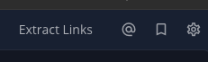
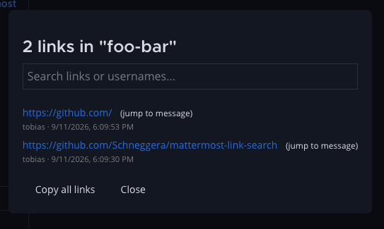

# mattermost-link-search
This userscript adds a button to Mattermost to extract links from the current channel or direct messages.

## Installation

1. Install a user script manager extension like [Violentmonkey](https://violentmonkey.github.io/).
2. Click [here](https://raw.githubusercontent.com/Schneggera/mattermost-link-search/refs/heads/main/link_extractor.user.js) to install.
3. You see the error message "Bad pattern YourURL:"
    1. Click on edit
    2. Replace YourURL with the URL of your mattermost instance, e.g. https://mattermost.xyz.com/*

## How it works

